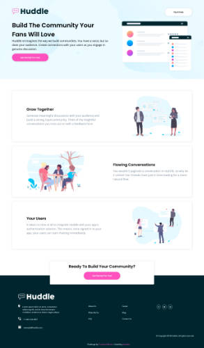

# Frontend Mentor - Huddle landing page with alternating feature blocks solution

This is a solution to the [Huddle landing page with alternating feature blocks challenge on Frontend Mentor](https://www.frontendmentor.io/challenges/huddle-landing-page-with-alternating-feature-blocks-5ca5f5981e82137ec91a5100). Frontend Mentor challenges help you improve your coding skills by building realistic projects. 

## Table of contents

- [Overview](#overview)
  - [The challenge](#the-challenge)
  - [Screenshot](#screenshot)
  - [Links](#links)
- [My process](#my-process)
  - [Built with](#built-with)
  - [What I learned](#what-i-learned)
  - [Continued development](#continued-development)
  - [Useful resources](#useful-resources)
- [Author](#author)


## Overview

### The challenge

Users should be able to:

- View the optimal layout for the site depending on their device's screen size
- See hover states for all interactive elements on the page

### Screenshot




### Links

- [Solution URL](https://www.frontendmentor.io/solutions/html-css-flexbox-grid-custom-css-variables-1SHfKb9x7)
- [Live Site URL](https://jeanettew.github.io/Frontend-Mentor-Huddle-landing-page-with-alternating-feature-blocks/)

## My process

### Built with

- Semantic HTML5 markup
- CSS custom properties
- Flexbox
- CSS Grid
- [GoogleFonts](https://fonts.google.com/)
- [FontAwesome](https://fontawesome.com/) - Icons


### What I learned

With this project I learned a bit more about CSS Variables. I have not learned about this in any of my courses, but with very little research managed just fine. 

I learned a lot more about the connection between HTML and CSS when it comes to flexbox and grid. The initial layout is very important for flexbox and grid to respond the way intended and to make the mobile version functional. 

The bottom call to action was interesting. Display and position properties can be used to position this, but I found a much easier way by using a negative margin. Very simple 1 line code. 
```css
footer {
  margin-top: -6rem;
  z-index: -1;
}
```
Spacing is a bit of a problem when you do not have the actual design file and work from jpeg's.

### Continued development

I still need to work a bit on creating more space between elements. I tend to be a bit stingy with white space. Using white space correctly can turn your designs into a profesional looking site. 

I will also still be looking at responsive font as well as learning to use calculations in my CSS. 

### Useful resources

I did not really find any new resources and mostly refered back to previous resources. 

## Author

- Website - [Jeanette Watts](https://jeanettew.github.io/FCC-Personal-Portfolio-Page/)
- Frontend Mentor - [@JeanetteW](https://www.frontendmentor.io/profile/JeanetteW)
- Twitter - [@JeanetteE81](https://twitter.com/JeanetteE81)


